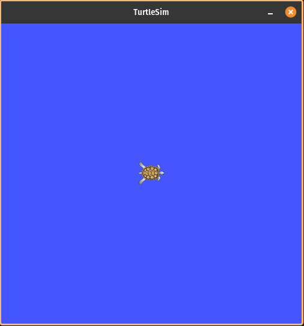
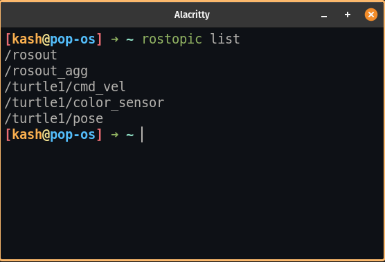
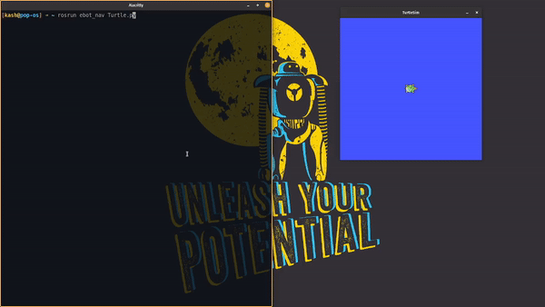

# **GETTING FAMILIER WITH TURTLESIM**

+ Execute the following command for running the ROS master

```
roscore
```

+ Now run the turtlesim

```
rosrun turtlesim turtlesim_node
```

+ You will see this kind of window and probebly with different turtle



+ For exploring the topics run the following command 

```
rostopic list
```

+ Output



+ Following topics are important 

    + ```/turtle1/cmd_vel```
        + For publishing the velocity
    + ```/turtle1/pose```
        + For getting the position and orientation of the turtle
    
+ You can subscribe and publish the topics for complitting the task

## **Final Output**

