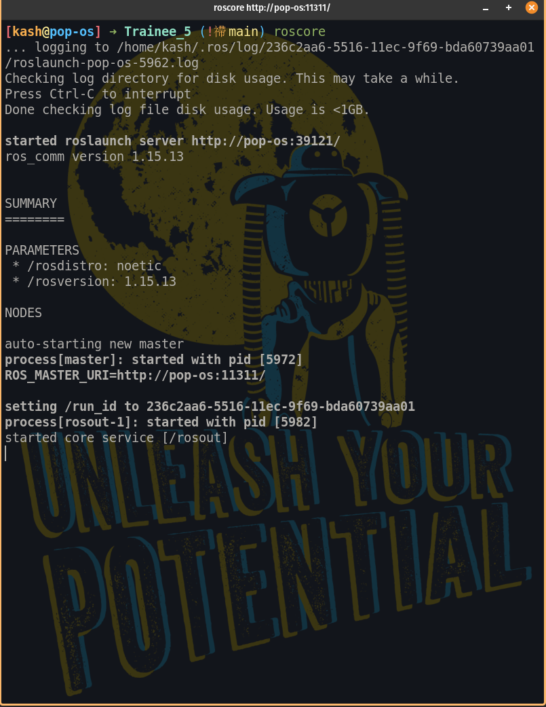

# **INSTALLATION OF ROS**

+ Hope you have installed Ubantu 20.04, If not kindly do it.

## **ROS Noetic Ninjemys Installation**

+ ROS is collection of libraries which will be help to create robot applications. It's open source and have BSD licence.

### **Installation Steps**

1. Setting up your pc for accepting packages from ROS.

```
sudo sh -c 'echo "deb http://packages.ros.org/ros/ubuntu $(lsb_release -sc) main" > /etc/apt/sources.list.d/ros-latest.list'
```

2. Setting up keys.
    + curl is Command line tool and library for transferring data with URL syntax.
```
sudo apt install curl
```

```
curl -s https://raw.githubusercontent.com/ros/rosdistro/master/ros.asc | sudo apt-key add -
```

3. Making sure that all the debian packages are up-to-date.

```
sudo apt update
```

4. Installing the ROS recomended configuration( **ALERT: It will take some time to download and more time to build, So be calm and see the process also notice all the things to be installe.**)

```
sudo apt install ros-noetic-desktop-full
```

### **Configuration Steps**

1. Adding environment variables to your ***.bashrc*** so that everytime you open your terminal and your envinment will be set

    + ***.bashrc** will be executed first when you open the termenal(if you are using ***BASH***) 
    + For more information kindly do the web search

```
echo "source /opt/ros/noetic/setup.bash" >> ~/.bashrc
```

+ Open a fresh terminal and run this command

```
roscore
```
+ If every thing will be right then you will going to see this output.



+ **Informetion Alert**
    + by running roscore you will run ROS master( For more information please read that PDF)

2. Let's install additional dependencies for building ROS packages

```
sudo apt install python3-rosdep python3-rosinstall python3-rosinstall-generator python3-wstool build-essential
```

3. Let's install rosdep for building the packages from that we will be able to compile the packages

```
sudo apt install python3-rosdep
```

```
sudo rosdep init
```

```
rosdep update
```

### **Additional Installation**

+ Tools for catkin

```
sudo apt-get install ros-noetic-catkin python3-catkin-tools
```

+ turtlesim

```
sudo apt-get install ros-noetic-ros-tutorials
```
