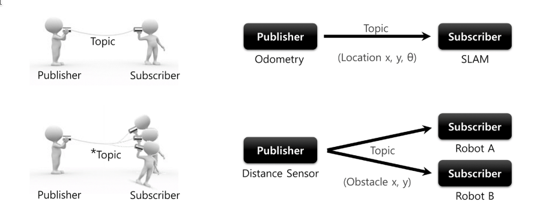
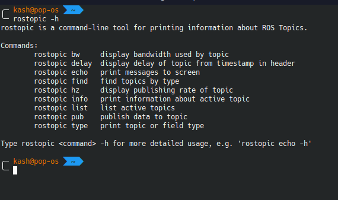
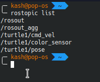

# **ROS TOPICS**

- ROS topics allows **unidirectional** communication between ROS nodes.
- When using ROS Topics ROS Node can be a **publisher, subscriber or both**.
- Publisher and Subscriber Nodes will exchange ROS Messages over a ROS Topic.
- ROS message is aq simple data structure(ex: integer, floating point, boolean, string, etc.). So a ROS message can hold data of various data-types.
- Let's take a terminology
    + You are ordering a **newspaper** named as **bhaskar**, Which is **published** by **bhaskar times**.
    + every morning **ramu kaka** will **deliver** **bhaskar** to you.
    + You like **bhaskar** because it is having **madhurima**, **chitralok** section.
- In this analogy we can relate.
    + >bhaskar times <---> Publisher Node
    + >You <---> Subcriber Node
    + >ramu kaka <---> Topic
    + >bhaskar <--> ROS message
    + >madhurima and chitralok <---> data fields defined in ROS messages



+ Basically ROS Publisher will ```brodcast``` the message and any Node can subsctibe it and take the information.
+ TOpics are named ```buses``` over which ```nodes``` exchange ```messages```. 
+ Topics have anonymous publish/subscribe sementics which decouples the production of information from it's consumption.
    - Inshort ```nodes``` are not aware of that who they are communicating. Insted of that they are intrested in a perticular data.

### **Topic Types***

+ Eac topic is strongly typed by the ```ROS Messages``` type used to publish to it and nodes can only receive messages with a matching type(or else you will get an error).
    + subscriber should clearly specify the message type before receiving a perticular message.
    + All ROS clients check to makesure that an MD5 computed from the ```msg files```  match. This check ensures that the ROS Nodes were compiled from consistent code bases.

### **Topic Transport**

> + ROS currently supports ```TCP/IP based and UDP- based ```message transport.
> + TCP based transport is known as ```TCPROS``` and streams message data over persistent TCP/IP connections.
> + TCPROS is the default transport used in ROS and is the only transport that client libraries are required to support. 
> + The UDP-based transport, which is known as UDPROS and is currently only supported in roscpp, separates messages into UDP packets. UDPROS is a low-latency, lossy transport, so is best suited for tasks like teleoperation.
> + ROS nodes negotiate the desired transport at runtime. For example, if a node prefers UDPROS transport but the other Node does not support it, it can fallback on TCPROS transport. This negotiation model enables new transports to be added over time as compelling use cases arise.

+ There is one command for viewing the topics and it's related information.

```
rostopic -h
```


``` 
rostopic type [topic]
```
+ Communication on topics happens by sending ROS messages between nodes. To communicate, the publisher and subscriber must send and receive the same ```type``` of message. This means that a topic ```type``` is defined by the message ```type``` published on it. The ```type``` of the message sent on a topic can be determined using rostopic ```type```.

> For understanding this in better form do the following:

+ Run ros master in one terminal
```
roscore
```
+ run below command in other terminal window.
```
rosrun turtlesim turtlesim_node
```
+ Now run:
```
rostopic list
```

>Output



+ Now run:
```
rostopic type /turtle1/cmd_vel
```
>Output

+ It will be the message type.
```

╭─ kash@pop-os  ~                        ✔  6828  00:52:09
╰─ rostopic type /turtle1/cmd_vel 
geometry_msgs/Twist
```

+ As we observed the type of message associated with ```/turtle1/cmd_vel``` topic is ```geometry_msgs/Twist```. let's look more details about this message.

+ Run:
```
rosmsg show geometry_msgs/Twist
```
>Output
```
╭─ kash@pop-os  ~                        ✔  6838  01:01:51
╰─ rosmsg show geometry_msgs/Twist

geometry_msgs/Vector3 linear
  float64 x
  float64 y
  float64 z
geometry_msgs/Vector3 angular
  float64 x
  float64 y
  float64 z

```
+ Messges consist of ```fields``` and ```constants```.
+ ```fields``` are dataypes and ```constants``` are representative values.
+  From the above output, you can observe that these field and constants are displayed twice. However, both of these sections, are separate since they have a different header or different sub-information from the same robot. The 2 headers seen are...
     
     +  ```geometry_msgs/Vector3 linear```: Describes the linear velocities of all the 3 axes.

     + ```geometry_msgs/Vector3 angular```: While this header describes, angular velocities of all 3 axes.

```
rostopic info /turtle1/cmd_vel
```
>Output

```
─ kash@pop-os  ~                      1 ↵  6841  01:03:1
╰─ rostopic info /turtle1/cmd_vel 
Type: geometry_msgs/Twist

Publishers: None

Subscribers: 
 * /turtlesim (http://pop-os:34703/)

```
+ The output of this command will display both:
    + message type
    + Publishing and subcribing Node.


```
rostopic pub...
```
+ you can figure out by your own
+ it's for publishing the value from terminal.
+ you can use ```-h``` for seeking help from terminal.

```
rostopic echo [TopicName]
```
+ It's for printing published message into the terminal itself

## **Example #1: Pub-Sub with Custom Message**

### **Aim**

To write a ````listener```` and ```talker ```node which should communicate with each other over a ROS Topic called ```my_topic ```using a custom ROS Message called ```myMessage``` with the following data fields of the following data types.

```
1. int32 id
2. string name
3. float32 temperature
4. float32 humidity
```
### **Steps**

#### **Create Custom ROS message**

+ Messages are just a simple text file with field type and field name per line.
+ They are stored in ```msg``` directory of our package.

1. Creare a file and name it ```myMessage.msg``` and store it into the ```msg``` folder of ```ros_basics``` package. If folder does not exist then create it.

2. Now fill the ```myMessage.msg``` file with the following content.

```
int32 id
string name
float32 temperature
float32 humidity
```
This is the format of the typical ```msg``` file.

3. Now open ```package.xml``` file of ```ros_basics``` and add the dependencies for our ```message_generarion``` and ```message_runtime``` as seen below.

```
<?xml version="1.0"?>
<package format="2">
  <name>pkg_ros_basics</name>
  <version>0.1.0</version>
  <description>The pkg_ey_ros_basics package</description>

  <maintainer email="eyantra@todo.todo">eyantra</maintainer>

  <license>TODO</license>

  <buildtool_depend>catkin</buildtool_depend>
  <build_depend>geometry_msgs</build_depend>
  <build_depend>rospy</build_depend>
  <build_depend>message_generation</build_depend>
  
  <build_export_depend>geometry_msgs</build_export_depend>
  <build_export_depend>rospy</build_export_depend>
  
  <exec_depend>geometry_msgs</exec_depend>
  <exec_depend>rospy</exec_depend>
  <exec_depend>message_runtime</exec_depend>


  <!-- The export tag contains other, unspecified, tags -->
  <export>
    <!-- Other tools can request additional information be placed here -->

  </export>
</package>
```
>```message_generation``` will actually depend on all default supported generators and makes sure that they are actually present. Otherwise e.g. when building Debians on the farm for a package containing messages it might not have any language specific message generators installed.

>```geometry_msgs``` provides messages for common geometric primatives such as ```points, vectors, and poses```. These primatives are designed to provide a common data type and facilitate interoperability throughout the system.

>In the same way, ```message_runtime``` is a package used for build-time dependencies to generate language bindings of messages. This means that is the package in charge of compiling and generating all the needed files when you add a custom msg type, service, action etc. in your package.

4. Now open your ```CMakeliist.txt``` of ```ros_basics``` and navigate to the following block of code in your file.

```
#add_message_files(
#   FILES
#   Message1.msg
#   Message2.msg
# )
```
Uncomment the Messages and add include the name of your message files. You can include multiple message files if require.

Now your ```CMakelist.txt``` should look like this:

```
cmake_minimum_required(VERSION 3.0.2)
project(pkg_ros_basics)


find_package(catkin REQUIRED COMPONENTS
  geometry_msgs
  rospy
  message_generation
)

add_message_files(
  FILES
  myMessage.msg
)

generate_messages(
  DEPENDENCIES
  geometry_msgs
  std_msgs
)


catkin_package(
#  INCLUDE_DIRS include
#  LIBRARIES control_turtle
 CATKIN_DEPENDS geometry_msgs rospy message_runtime

)

###########
## Build ##
###########

include_directories(
# include
  ${catkin_INCLUDE_DIRS}
)
```

5. After this build your package.

```
cd ~/katkin_ws
catkin_make
```

> Remember package.xml file is importent for specifying dependencies, if you haven't mentioned a perticular dependency and you have used it in CMakelist.txt then it will throw the error at the build time so make sure to observe each steps carefully! and if needed then please see all the dependencies propperly.

>Once package is build successfully you can see ```myMessage.h``` file lockated at ```~/katkin_ws/devel/include/ros_basics/myMessages.h``` This will be used by ROS Nodes to communicate over a ROS topic using ```myMessage``` ROS Message.


## **Code--> ROS Nodes**

### **Listener Node**

```node_myMsg_listener.py```

```
#!/usr/bin/env python3

import rospy
from pkg_ros_basics.msg import myMessage


def func_callback_topic_my_topic(myMsg):

    rospy.loginfo("Data Received: (%d, %s, %.2f, %.2f)", myMsg.id,
                  myMsg.name, myMsg.temperature, myMsg.humidity)


def main():

    # 1. Initialize the Subscriber Node.
    rospy.init_node('node_myMsg_listener', anonymous=True)

    # 2. Subscribe to the desired topic and attach a Callback Funtion to it.
    rospy.Subscriber("my_topic", myMessage, func_callback_topic_my_topic)

    # 3. spin() simply keeps python from exiting until this node is stopped
    rospy.spin()


# Python Main
if __name__ == '__main__':
    try:
        main()
    except rospy.ROSInterruptException:
        pass
```
> ```from ros_basics.msg import myMessage``` 
> + This line we are writing for importing custom message type.
> + You are knowing that this Messae type exist with ros_basics package but for others, they can run the following command and see wather this message types are exist or not.
```
╭─ kash@pop-os  ~              ✔  6900  15:51:32
╰─ rosmsg list | grep ros_basics
pkg_ros_basics/myMessage
ros_basics/myMessage
╭─ kash@pop-os  ~              ✔  6901  15:51:35
╰─ 
```
> + You can observe message structure also:
```
─ kash@pop-os  ~                     ✔  6904  15:54:37
╰─ rosmsg show ros_basics/myMessage
int32 id
string name
float32 temperature
float32 humidity

╭─ kash@pop-os  ~                     ✔  6905  15:54:40
```
> + At this stage you are knowing ```rospy.init_node()``` function

#### **rospy.Subscriber(......)**

+ It's the function for subscribing a perticular topic.
+ It's Parameters are as follows:
  + **name**
    + it's in ```string``` datatype which will specify the name of topic to be subscribed
  + **data_class(Message class)**
    + Name of ```message``` needs to be provided here.
    + If you are using any custom message type then you need to specify the name of ```message file``` without it's ```.msg``` extenction.
      + for ex: ```myMessage```
    + If you are using any default message type then you need to specify it's name only.
      + For ex: ```Float32```, ```String```, etc
  + **callback((fn(msg, cb_args))**
    + function will be called when the data will be published.
    + you need to write the function by considering the information to be received.
    + if you have set your program to run of frequency 0.1Hz and message is being published on topic on each second then callback function will be invoked on each second. you can think of a kind of ```threding``` work. it will not wait for 10 second(according to frequecy) but it will instently receive the message.
  + **callback_args(Not necssary)**
    + It's additional arguments to pass to the callback. This is useful when you wish to reuse the same callback for multiple subscriptions.
  + **queue_size(int)**
    + Maximum number number of messages to receive at a time.
    +  This will generally be 1 or None (infinite, default). buff_size should be increased if this parameter is set as incoming data still needs to sit in the incoming buffer before being discarded. Setting queue_size buff_size to a non-default value affects all subscribers to this topic in this process.
  + **buff_size(int)(Not necessary)**
    + Incomig message buffer size in bytes. If queue_size is set, this should be set to a non-default value affects all subscribers to this topic in this process.
  + **tcp_nodelay(bool)(Not necessary)**
    +  if True, request TCP_NODELAY from publisher. Use of this option is not generally recommended in most cases as it is better to rely on timestamps in message data. Setting tcp_nodelay to True enables TCP_NODELAY for all subscribers in the same python process.

### **callback function**
```
def func_callback_topic_my_topic(myMsg):

    rospy.loginfo("Data Received: (%d, %s, %.2f, %.2f)", myMsg.id,
                  myMsg.name, myMsg.temperature, myMsg.humidity)
```
+ Here in the argument as a parameter you can specify any name which name you want but keep it in a meaningful way.


### **Talker Node**

```node_myMsg_talker.py```

```
#!/usr/bin/env python

import rospy
from pkg_ros_basics.msg import myMessage

import random


def main():
    
    # 1. Create a handle to publish messages to a topic.
    var_handle_pub = rospy.Publisher('my_topic', myMessage, queue_size=10)
    
    # 2. Initializes the ROS node for the process.
    rospy.init_node('node_myMsg_talker', anonymous=True)

    # 3. Set the Loop Rate 
    var_loop_rate = rospy.Rate(1) # 1 Hz : Loop will its best to run 1 time in 1 second
    
    # 4. Write the infinite Loop
    while not rospy.is_shutdown():
        obj_msg = myMessage()

        obj_msg.id = 1
        obj_msg.name = "my_message"
        obj_msg.temperature = 10 + random.random()
        obj_msg.humidity = 20 + random.random()

        rospy.loginfo("Publishing: ")
        rospy.loginfo(obj_msg)

        var_handle_pub.publish(obj_msg)

        var_loop_rate.sleep()


# Python Main
if __name__ == '__main__':
    try:
        main()
    except rospy.ROSInterruptException:
        pass
```
#### **rospy.Publisher(...)**

>rospy.Publisher(topic_name, msg_class, queue_size)

+ It's the function for publishing the message on a perticular topic from a node.
+ It's parameters are as follows:
  + **name**
    + name of the topic to be specified here.
    + for ex: ```"myMsg"```.
  + **data_class**
    + message class for serialization
  + **tcpnodelay(bool)(Not necessary)**
    + If True, sets TCP_NODELAY on publisher's socket (disables Nagle algorithm). This results in lower latency publishing at the cost of efficiency.
  + **latch(bool)(Not necessary)**
    + If True, the last message published is 'latched', meaning that any future subscribers will be sent that message immediately upon connection.
  + **keaders(dict)(Not necessary)**
    + If not None, a dictionary with additional header key-values being used for future connections.
  + **queue_size(int)**
    + The queue size used for asynchronously publishing messages from different threads. A size of zero means an infinite queue, which can be dangerous. When the keyword is not being used or when None is passed all publishing will happen synchronously and a warning message will be printed.
  + **subscriber_listener=rospy.SubscribeListener(Not necessary)**
    + Receive callbacks via a rospy.SubscribeListener instance when new subscribers connect and disconnect.


> This ```rospy.publisher``` will return the object of ```<class 'rospy.topics.Publisher'>``` which will be catch and latter on it will be used for publishe the message of a perticular format.

> ```myMessage()``` will return the object of ```<class 'pkg_ros_basics.msg._myMessage.myMessage'>```. This object is used for setting up the messages and then another object which is origined from publisher will publish it with this object as an argument. returened object will be stored in ```obj_msg``` here.
>>It's basically message object of custom message type.

+ ```var_loop_rate = rospy.Rate(1) # 1 Hz : Loop will its best to run 1 time in 1 second``` will only being written after initialization of the ```node``` orelse you will get error like: ``` raise rospy.exceptions.ROSInitException("time is not initialized. Have you called init_node()?")
rospy.exceptions.ROSInitException: time is not initialized. Have you called init_node()?```
---
---
## **UNDERSTAND9ING HOW TO USE MESSAGE TYPE IN PREBUILD MESSAGE TYPES**

+ Firstly search the topic on which you need to subscribe or publish the messages.

>Here we are selecting ```/turtle1/cmd_vel```
>> you can see the active topics from ```rostopic list``` command.

>THen write this command 
```
rostopic info /turtle1/cmd_vel
```
>Output
```
Type: geometry_msgs/Twist

Publishers: None

Subscribers: 
 * /turtlesim (http://pop-os:44161/)
```
+ See the Type very carefully
  + it's constaning ```geometry_msgs``` which is the name of the package
  + ```Twist``` will be the name of the message file.

>Now write this command:
```
rosmsg show geometry_msgs/Twist
```
>Output
```
geometry_msgs/Vector3 linear
  float64 x
  float64 y
  float64 z
geometry_msgs/Vector3 angular
  float64 x
  float64 y
  float64 z
```
+ This will give yo entire message structure

> For importing this message type in ``` your script``` you can write:
```
from geometry_msgs.msg import Twist
```
+ If you want to publish the message on this topic then you need to write publisher function like this:

```
pub=rospy.Publisher('/turtle1/cmd_vel',Twist,queue_size=10)
```
+ For getting the message type of ```Twist```:
```
msg=Twist()
```
+ you can set the message parameters by siignment operators or logic expression:
```
msg.linear.x=2
msg.linear.y=2
msg.linear.z=10
msg.angular.z=5
msg.angular.y=2
msg.angular.x=2
```
+ For publishing on the same topic:
```
pub.publish(msg)
```
+ If you want to Subscribe the perticular topic and want to get the message then callback you can obviously write and receive the message.

+ For writing the subscriber 
```
rospy.Subscriber('/turtle1/cmd_vel',Twist,Callback_function)
```

+ Call back function:
```
def Callback_function(my):

    rospy.loginfo("Data Received: (%d, %s, %.2f, %.2f)", my.id,
                  my.name, my.temperature, my.humidity)
