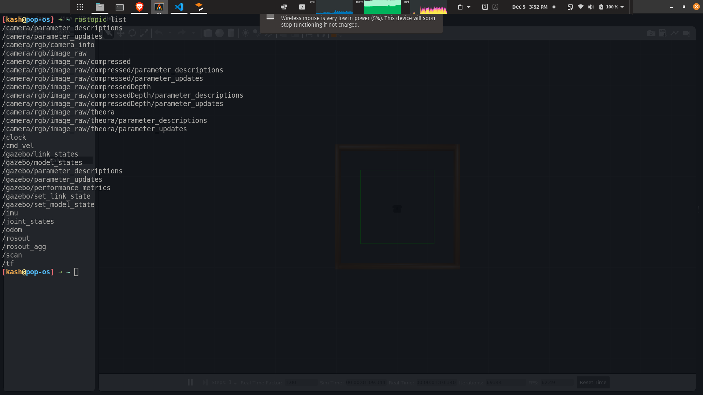

# **FIRM INTRODUCTION TO TURTLEBOT**

+ Execute the folliowing command for launching the bot

```
roslaunch turtlebot3_gazebo turtlebot3_stage_1.launch
```

+ Open a fresh terminal and explore the ROS topics

```
rostopic list
```

+ Output



+ Get some information about lidar

[LIDAR](https://youtu.be/VhbFbxyOI1k)

+ **TODO**
    + Understand the requirements of distance sencing
    + Different distance sancing sensors and it's usecases

+ Get that how turtlebot will publish the data of distance

+ Execute the following commands for understanding ```/scan``` data

```
export TURTLEBOT3_MODEL=waffle_pi
```
```
roslaunch turtlebot3_gazebo turtlebot3_stage_1.launch
```

+ open a new terminal and execute the following command

```
rostopic echo /scan
```

+ For exploring the message structure write the following command

```
rosmsg show sensor_msgs/LaserScan
```

+ Output

```
std_msgs/Header header
  uint32 seq
  time stamp
  string frame_id
float32 angle_min
float32 angle_max
float32 angle_increment
float32 time_increment
float32 scan_time
float32 range_min
float32 range_max
float32[] ranges
float32[] intensities
```

+ Here 
    + Min angle         : 0.0
    + Max angle         : 6.28( 2*pi )
    + angle increment   : @(0.01199999 radian)
    + ranges            : it will containg 360 degree data of distances

## **Now we need to create the script for controlling the TurtleBot3**

[Follow this link for understanding the movement through script](https://www.theconstructsim.com/wall-follower-algorithm/)

Follow this links for understanding PID and write it in code

[Link-1 for PID understanding](https://www.youtube.com/watch?v=wkfEZmsQqiA&list=PLn8PRpmsu08pQBgjxYFXSsODEF3Jqmm-y)

[Link-2 for PID Implimenttion( Find code link in the description)](https://youtu.be/JFTJ2SS4xyA)

[ Additlonal exclusive content for getting hints in wall following](https://www.youtube.com/watch?v=GMadsuBmGxU)


> We hope that it will be sufficient for complitting the learning about PID and TurtleBot3 :)
