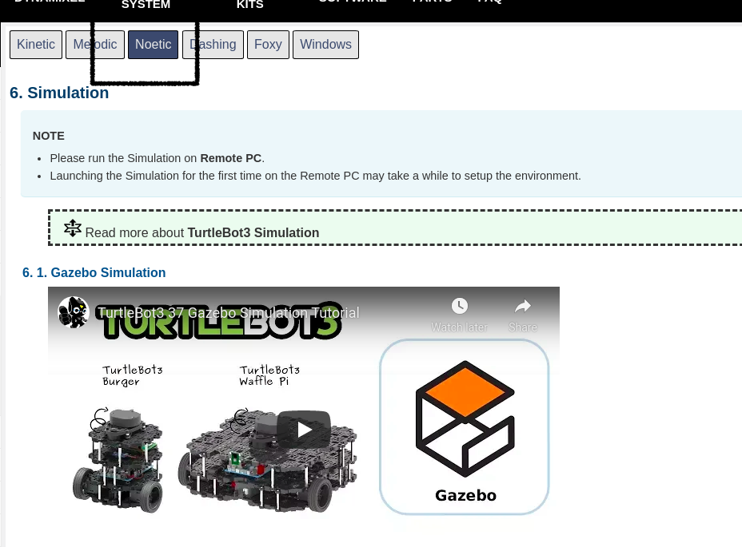

# **INSTALLATION OF TURTLEBOT3**

[Installation](https://emanual.robotis.com/docs/en/platform/turtlebot3/simulation/#gazebo-simulation)

+ Make sure that you are selecting the Noetic option while installing the packages



## **Fun Activity**

+ Execute the following commands for controlling the bot with the help of keyboard

+ For selecting the model

```
export TURTLEBOT3_MODEL=waffle_pi
```

+ Launching the gazebo world

```
roslaunch turtlebot3_gazebo turtlebot3_empty_world.launch
```

+ Controlling the bot with keyboard

```
roslaunch turtlebot3_teleop turtlebot3_teleop_key.launch
```

+ Be on the terminal and press appropreate keys for movement of the bot

